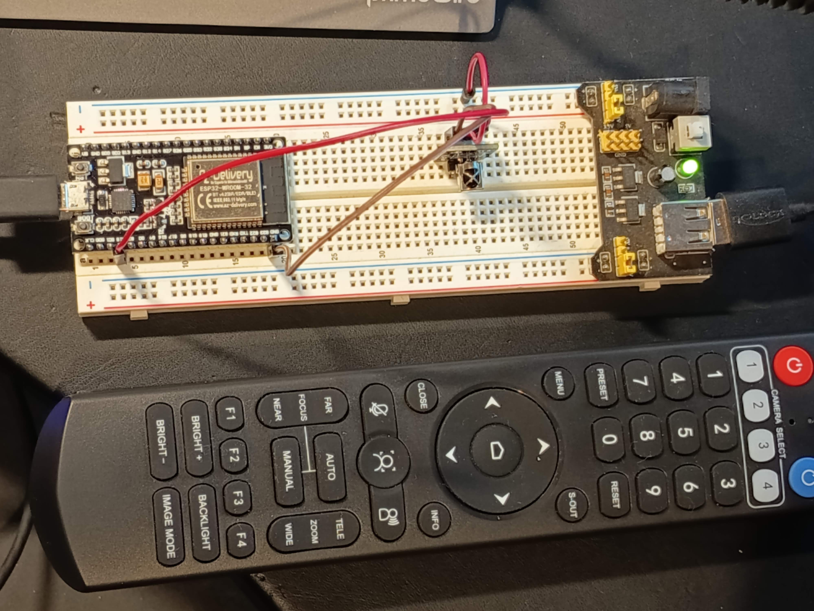

# esp32-IRremote

Dieses Projekt zeigt, wie man mit einem **ESP32** und dem **AZ-Delivery KY-022 IR Receiver Modul (CHQ1838)** IR-Codes einer Fernbedienung auslesen kann – insbesondere zum Steuern einer PTZ-Kamera. Die erfassten IR-Codes können später mit einem **KY-005 IR-Sendemodul** wieder gesendet werden.
Hauptsächlich geht es mir um das Aus- und Einschalten des **"AI Trackings"** meiner **HDKATOV PTZ Kamera**. Diese Funktion kann derzeit nur über einer Fernbedienung, nicht aber über die Weboberfläche remote erfolgen. Die chinesische Herstellerfirma war trotz mehrmaliger Nachfrage bisher nicht imstande, uns eine Auskunft zu geben, wie diese AI Tracking Funktion remote ohne Fernbedienung aktiviert und deaktiviert werden kann. Deswegen will ich mir ein Modul bauen, welches an der Kamera befestigt wird, um aus der Ferne, per Wifi, das AI Tracking ein- und auszuschalten.

---

## 📦 Hardware

- ESP32 DevKit (z. B. von AZ-Delivery)
- KY-022 IR-Empfänger (CHQ1838-basiert)
- Standard-Fernbedienung (z. B. PTZ-Remote)
- (später: KY-005 IR-Sender-LED)

---

## 🔌 Anschluss KY-022 an ESP32

| KY-022 Pin | Funktion | Verbindung zum ESP32 |
|------------|----------|----------------------|
| S          | Signal   | GPIO **15**          |
|   | 3,3 Volt | externe Spannung |
| –          | GND      | GND                  |

> Das Modul wurde von mir mit 3.3 V über einen separater Anschluss versorgt. Geht vieleicht auch anders.

---

## 📟 Beispielsketch: IR-Codes empfangen

```cpp
#include <IRremote.hpp>

#define IR_RECEIVE_PIN 15  // Pin für KY-022 OUT

void setup() {
  Serial.begin(115200);
  delay(200);

  IrReceiver.begin(IR_RECEIVE_PIN, ENABLE_LED_FEEDBACK);
  Serial.println("IR-Empfänger bereit. Bitte Taste auf Fernbedienung drücken.");
}

void loop() {
  if (IrReceiver.decode()) {
    Serial.print("Empfangen: 0x");
    Serial.println(IrReceiver.decodedIRData.decodedRawData, HEX);

    Serial.print("Protokoll: ");
    Serial.println(getProtocolString(IrReceiver.decodedIRData.protocol));

    IrReceiver.resume();
  }
}

```

## 📋 Erfasste IR-Codes (PTZ-Fernbedienung)

|Taste|Code|Protokoll|
|-----|----|---------|
|Links|0x51D1D|Sony|
|Rechts|0x51D1C|Sony|
|Hoch|0x51D1A|Sony|
|Runter|0x51D1B|Sony|
|AI Toggle (An/Aus)|0x6A49|Sony|

**Die gleiche Taste auf der Fernbedienung wird verwendet, um die AI-Tracking-Funktion ein- und auszuschalten. Das entsprechende Signal (0x6A49, Sony-Protokoll) wird von der Kamera als Toggle-Befehl interpretiert.**

## 🧪 Weiteres
Mit diesem Code 
```cpp
IrSender.sendSony(0x6A49, 15)
```
kann z.B. die AI-Tracking-Funktion ausgelöst werden.
Das nächste Ziel ist die Wiedergabe dieser Codes über das KY-005 IR-Sendermodul, um die Funktion per ESP32 fernzusteuern (z. B. über WLAN oder physische Taste bzw. ein elgato Streamdeck).

## 🔧 Abhängigkeiten
- Arduino IDE ≥ 2.x
- IRremote Bibliothek (aktuelle Version von Armin Joachimsmeyer)
- ESP32-Boardmanager installiert (via Boardverwalter)

## Update
Die erfassten Codes werden leider mit dem **AZ-delovery KY-022 Set IR Receiver Infrared Receiver CHQ1838 Sensor Modul** nicht sauber gesendet. Deswegen habe ich in einem zweiten Schritt die Senderohdaten der Fernbedienung erfasst:
```cpp
#include <IRremote.hpp>

#define IR_RECEIVE_PIN 15  // Dein Empfangspin (z. B. vom KY-022 Modul)

void setup() {
  Serial.begin(115200);
  delay(200);
  IrReceiver.begin(IR_RECEIVE_PIN, ENABLE_LED_FEEDBACK);
  Serial.println("Starte RAW-Code-Empfang...");
}

void loop() {
  if (IrReceiver.decode()) {
    Serial.println("====== IR-Empfang (RAW) ======");
    IrReceiver.printIRResultRawFormatted(&Serial); // gibt die rawbuf[]-Werte formatiert aus
    IrReceiver.resume();
    Serial.println();
  }
}
```
Damit bekomme ich solche Werte:
```
# für AI Tracking an/aus (Toggle):
19:22:48.428 -> ====== IR-Empfang (RAW) ======
19:22:48.428 -> rawData[32]: 
19:22:48.428 ->  -20450
19:22:48.428 ->  +2350,- 650
19:22:48.428 ->  +1150,- 700 + 500,- 650 + 550,- 700 +1100,- 700
19:22:48.428 ->  + 500,- 750 + 450,- 700 +1150,- 650 + 550,- 700
19:22:48.428 ->  + 500,- 700 +1150,- 650 + 550,- 650 +1150,- 650
19:22:48.428 ->  + 550,- 650 +1150,- 700 +1100
19:22:48.428 -> Sum: 24650

# für Kamera nach RECHTS:
19:24:49.955 -> ====== IR-Empfang (RAW) ======
19:24:49.955 -> rawData[42]: 
19:24:49.955 ->  -14300
19:24:49.955 ->  +2300,- 700
19:24:49.955 ->  + 500,- 700 + 500,- 700 +1150,- 650 +1150,- 650
19:24:49.955 ->  +1150,- 650 + 550,- 650 + 500,- 750 + 450,- 750
19:24:49.955 ->  +1100,- 700 + 550,- 650 +1150,- 650 +1150,- 650
19:24:49.955 ->  +1150,- 700 + 500,- 700 + 500,- 700 + 500,- 700
19:24:49.987 ->  +1050,- 750 + 550,- 650 +1100,- 700 + 550
19:24:49.987 -> Sum: 31850

# für Kamera nach LINKS:
19:25:16.610 -> ====== IR-Empfang (RAW) ======
19:25:16.610 -> rawData[42]: 
19:25:16.610 ->  -13650
19:25:16.610 ->  +2400,- 600
19:25:16.610 ->  +1200,- 650 + 550,- 600 +1200,- 650 +1200,- 600
19:25:16.610 ->  +1150,- 650 + 550,- 650 + 600,- 600 + 600,- 600
19:25:16.641 ->  +1200,- 650 + 550,- 650 +1150,- 600 +1200,- 650
19:25:16.641 ->  +1150,- 650 + 550,- 650 + 550,- 650 + 550,- 700
19:25:16.641 ->  +1150,- 650 + 550,- 650 +1150,- 650 + 550
19:25:16.641 -> Sum: 32500
```
Damit konnte ich dann mit dem **AZ-Delivery KY-005 IR Infrared Emmission Sensor Modul** exakte Befehle senden :-)
